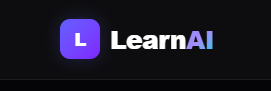
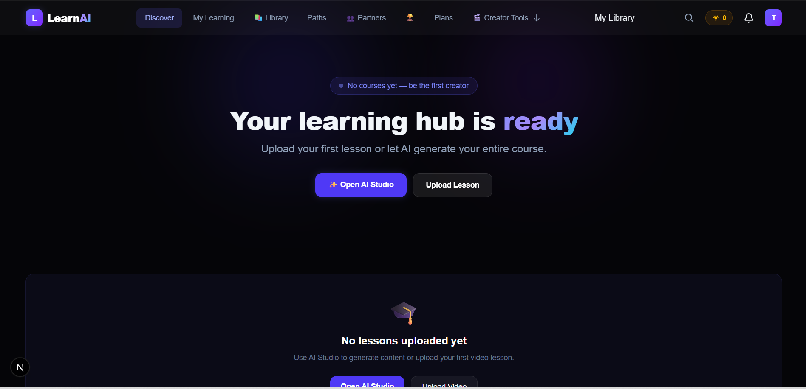
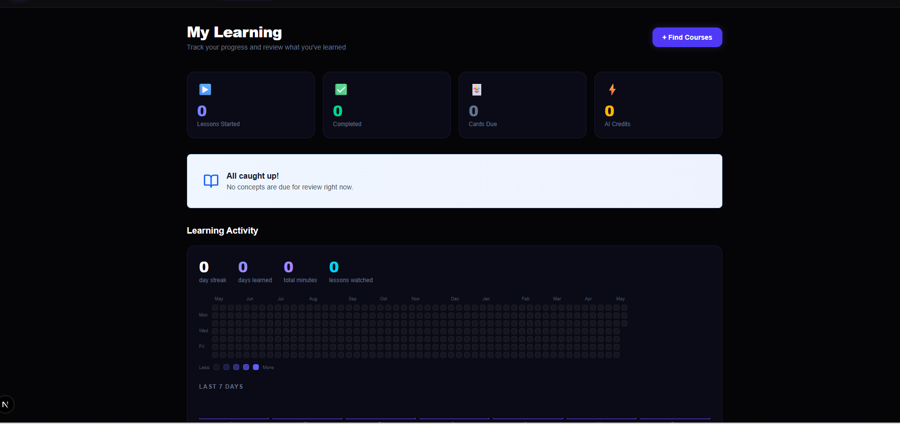
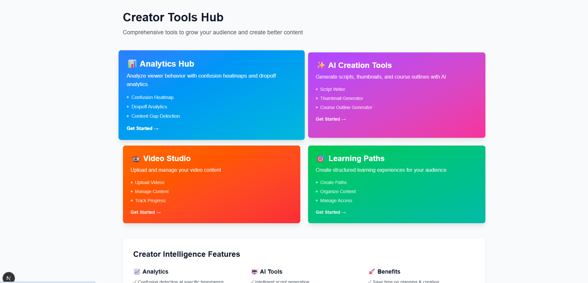

# LearnAI - AI-Powered Learning Platform

<div align="center">

![LearnAI Logo]
![Dashboard]
![Learning]
![Creator]


**Transform Education with AI-Driven Learning**

[Features](#-features) • [Quick Start](#-quick-start) • [Tech Stack](#-tech-stack) • [Docs](#-documentation)

[](https://opensource.org/licenses/MIT)
[](https://nodejs.org/)
[](https://nextjs.org/)
[](https://www.postgresql.org/)

</div>

---

## 📱 Overview

LearnAI is a next-generation learning platform that leverages artificial intelligence to create personalized, adaptive learning experiences. With features like AI-powered course generation, intelligent content analysis, and real-time feedback, LearnAI makes education more accessible and effective for both learners and creators.

### ⚡ Key Highlights
- 🤖 **AI-Powered Content** - Auto-generate scripts, thumbnails, and course outlines
- 📊 **Advanced Analytics** - Confusion heatmaps, dropout analysis, learner behavior
- 🎯 **Adaptive Paths** - Personalized learning journeys for each user
- 💬 **Social Learning** - Study groups, buddies, and accountability partners
- 🏆 **Gamification** - Badges, certificates, and leaderboards
- 📚 **Rich Content** - Videos with auto-chapters, flashcards, quizzes
- 🔐 **Secure** - Email verification, account lockout, JWT auth
- 🚀 **Modern Stack** - Next.js 16, React 18, PostgreSQL, Prisma

---

## ✨ Features

### 👨‍🎓 For Learners
- **Universal Learning Inbox** - Share any article, YouTube video, PDF, or note into the app (PWA share sheet or paste); AI extracts the key concepts straight into your spaced-repetition queue
- **Forgetting Forecast** - Per-concept memory projection ("you'll forget Recursion by Friday") with a one-click 5-minute save review and daily digest
- **Teach-Back (Feynman) Mode** - Explain a concept in your own words to an AI "student" (a 12-year-old, a beginner, or a skeptical expert); get graded on accuracy, completeness, and simplicity with knowledge gaps and jargon called out, then lock the score into your review schedule
- **Study Autopilot** - LearnAI schedules review slots from your due cards inside your preferred study window (days, hours, slot length) and serves them as a secret iCal feed — subscribe once from Google/Apple/Outlook Calendar and never plan a review again
- **Obsidian & Notion Export + Webhooks** - Download your whole learning graph as an Obsidian vault (Markdown + wikilinks) or a Notion import (Markdown + CSV database), or register HMAC-signed webhooks (`review.completed`, `concept.mastered`, …) to pipe events into Zapier, n8n, or your own scripts
- **Personalized Learning Paths** - AI-recommended courses based on goals
- **Interactive Flashcards** - Spaced repetition with adaptive difficulty
- **Video Learning** - Auto-generated chapters, timestamps, micro-lessons
- **Real-time Feedback** - Quiz scoring, instant explanations, difficulty rating
- **Progress Analytics** - Comprehensive stats, learning heatmaps, insights
- **Social Features** - Study groups, buddy matching, accountability partners
- **Gamification** - Earn badges, certificates, climb leaderboards
- **Mobile Support** - PWA for offline learning and mobile optimization

### 🎬 For Creators  
- **AI Script Generator** - Automatically generate video scripts from topics
- **Thumbnail Creator** - AI-powered thumbnail generation with customization
- **Course Builder** - Smart course outline generation and structuring
- **Analytics Hub** - Confusion heatmaps, dropout analytics, viewer insights
- **Content Analyzer** - Identify gaps and weak areas in content
- **Micro-Lessons** - Break videos into digestible chunks automatically
- **Monetization** - Subscriptions, credits system, premium content

### 🔧 Technical Features
- **Open Integrations** - Secret-URL iCal feed for calendars; one-click Obsidian vault / Notion (Markdown + CSV) / JSON exports; outbound webhooks signed with `X-LearnAI-Signature: t=<unix>,v1=<hex>` where `v1 = HMAC-SHA256(secret, "<t>.<body>")` — endpoints auto-disable after 8 consecutive failures
- **Security** - Account lockout (5 attempts), email verification, secure password reset
- **Error Monitoring** - Sentry integration for production issue tracking
- **CI/CD Pipeline** - GitHub Actions with automated testing and Vercel deployment
- **Real-time Notifications** - Toast notifications with Sonner library
- **Error Handling** - Error boundaries on all pages with graceful fallbacks
- **Rate Limiting** - Per-endpoint rate limiting with Upstash Redis
- **PWA Support** - Progressive Web App with offline capabilities

---

## 🛠️ Tech Stack

### Frontend
```
Next.js 16.1 + React 18.3 + Tailwind CSS 4.2
Sonner (Toasts) | Recharts (Analytics) | Motion (Animations)
```

### Backend
```
Node.js + Express-style Route Handlers
Prisma 7.5 (PostgreSQL ORM)
JWT + bcryptjs (Authentication)
Zod (Input Validation)
```

### AI & ML
```
OpenAI GPT-4 + Anthropic Claude
Vercel AI SDK 6.0
Groq SDK (Fast Inference)
DALL-E (Image Generation)
```

### Infrastructure
```
Database: PostgreSQL 15+ (Supabase/AWS RDS)
Storage: AWS S3 + CloudFront CDN
Hosting: Vercel (Production)
Monitoring: Sentry
CI/CD: GitHub Actions
```

---

## 📋 Prerequisites

```bash
✓ Node.js 18.0+
✓ npm 9.0+
✓ PostgreSQL 15+ (local or cloud)
✓ Git 2.0+
```

---

## ⚡ Quick Start

### 1. Clone & Install
```bash
git clone https://github.com/yourusername/stream-ai.git
cd stream-ai
npm install --legacy-peer-deps
```

### 2. Environment Setup
```bash
# Copy example env and fill in your values
cp .env.example .env
```
Only `DATABASE_URL`, `DIRECT_URL`, `JWT_SECRET`, and `NEXT_PUBLIC_APP_URL` are
required. Every optional integration (Stripe, S3, Upstash, Hedera, Sentry,
AI providers) disables itself gracefully when unset — see the comments in
[.env.example](.env.example).

### 3. Database
```bash
# Create & migrate database
npx prisma migrate dev

# Optional: Seed with sample data
npm run seed
```

### 4. Run
```bash
npm run dev
# Visit http://localhost:3000
```

---

## 📁 Project Structure

```
src/
├── app/                 # Next.js App Router
│   ├── api/            # API routes
│   ├── auth/           # Auth pages (login, register)
│   ├── learn/          # Learning dashboard
│   ├── creator/        # Creator tools & studio
│   └── [routes]        # Page routes
├── components/         # React components
│   ├── ui/             # Button, Card, Modal, etc.
│   ├── layout/         # Navbar, Sidebar
│   ├── auth/           # Auth components
│   └── analytics/      # Chart components
├── lib/                # Utilities
│   ├── prisma.js       # Database client
│   ├── auth.js         # JWT utilities
│   ├── email.js        # Email service
│   ├── accountLockout.js
│   └── rateLimit.js
├── hooks/              # Custom React hooks
└── context/            # React Context providers

prisma/
├── schema.prisma       # Database schema
└── migrations/         # Migration files

.github/
└── workflows/          # GitHub Actions CI/CD
    ├── test.yml        # Run tests on PR
    ├── deploy.yml      # Deploy on main
    └── lint.yml        # Code quality
```

---

## 🔐 Security Features

✅ **Security Headers** - CSP, HSTS, X-Frame-Options
✅ **Password Hashing** - bcryptjs with 12 rounds  
✅ **Account Lockout** - 5 failed attempts → 15 min lock
✅ **Email Verification** - Token-based verification
✅ **Password Reset** - Secure 1-hour expiry tokens
✅ **JWT Auth** - HTTP-only secure cookies
✅ **Rate Limiting** - Per-endpoint limits
✅ **Input Validation** - Zod schemas
✅ **Error Boundaries** - Graceful error handling

---

## 🧪 Testing

```bash
npm test              # Run tests
npm run test:watch   # Watch mode
npm run test:coverage # Coverage report
npm run lint         # ESLint
npm run build        # Build check
```

---

## 📦 Deployment

### Vercel (Recommended)
```bash
# Push to GitHub - auto-deploys
git push origin main

# Add secrets in Vercel dashboard
# All env vars from .env (production values)
```

### Environment Variables (Production)
```
DATABASE_URL=prod_database_url
JWT_SECRET=prod_jwt_secret
NEXT_PUBLIC_APP_URL=https://yourdomain.com
All AI service keys
```

---

## 🔄 CI/CD Pipeline

| Workflow | Trigger | Action |
|----------|---------|--------|
| **Test** | PR / Push to main | Run tests, lint, build |
| **Deploy** | Push to main | Deploy to Vercel |
| **Lint** | PR / Push | Code quality checks |

---

## 📊 Database Models

**Core Models**:
- User (auth & profile)
- Content (courses/videos)
- WatchProgress (learning tracking)
- Flashcard (spaced repetition)
- Quiz (assessments)
- PathEnrollment (course enrollment)
- Badge (achievements)
- StudyGroup (social learning)

See `prisma/schema.prisma` for full schema.

---

## 🤝 Contributing

Contributions are welcome! See [CONTRIBUTING.md](CONTRIBUTING.md) for the full
guide (dev setup, code conventions, testing, and how to report security issues).

1. Fork repository
2. Create feature branch: `git checkout -b feature/name`
3. Commit: `git commit -m 'Add feature'`
4. Push: `git push origin feature/name`
5. Open Pull Request

---

## 📞 Support

- **Issues**: [GitHub Issues](https://github.com/yourusername/stream-ai/issues)
- **Email**: hemangpatel0710@gmail.com
- **Website**: [learnai.com](https://vercel.com/hemang-patels-projects-e7360993/stream_ai)

---

## 📄 License

MIT License - see [LICENSE](LICENSE)

---

<div align="center">

**[⬆ back to top](#learnaiai-powered-learning-platform)**

Made with ❤️ by the LearnAI Team

</div>